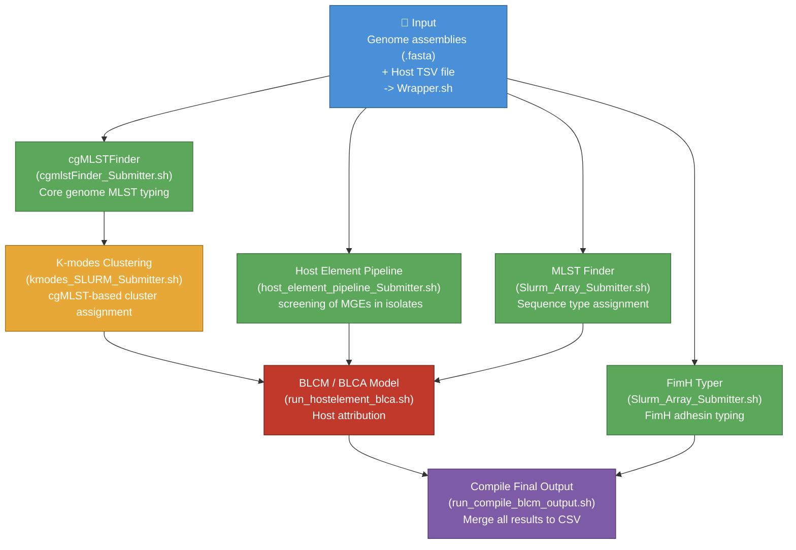

## Overview

```mermaid
flowchart TD
    A["📂 Input\nGenome assemblies (.fasta)\n+ Host TSV file\n-> Wrapper.sh"]

    A --> B["cgMLSTFinder\n(cgmlstFinder_Submitter.sh)\nCore genome MLST typing"]
    A --> C["Host Element Pipeline\n(host_element_pipeline_Submitter.sh)\n screening of MGEs in isolates"]
    A --> D["MLST Finder\n(Slurm_Array_Submitter.sh)\nSequence type assignment"]
    A --> E["FimH Typer\n(Slurm_Array_Submitter.sh)\nFimH adhesin typing"]

    B --> F["K-modes Clustering\n(kmodes_SLURM_Submitter.sh)\ncgMLST-based cluster assignment"]

    F --> G["BLCM / BLCA Model\n(run_hostelement_blca.sh)\nHost attribution"]
    C --> G
    D --> G

    G --> H["Compile Final Output\n(run_compile_blcm_output.sh)\nMerge all results to CSV"]
    E --> H

    style A fill:#4a90d9,color:#fff,stroke:#2c5f8a
    style B fill:#5ba85a,color:#fff,stroke:#3a6e39
    style C fill:#5ba85a,color:#fff,stroke:#3a6e39
    style D fill:#5ba85a,color:#fff,stroke:#3a6e39
    style E fill:#5ba85a,color:#fff,stroke:#3a6e39
    style F fill:#e8a838,color:#fff,stroke:#9e6e1a
    style G fill:#c0392b,color:#fff,stroke:#7b1f14
    style H fill:#7d5ba6,color:#fff,stroke:#4e3268
```

